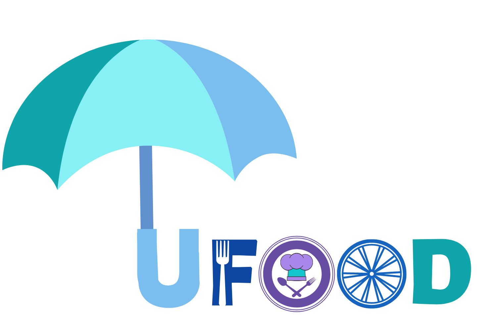

<!DOCTYPE html>
<html lang="en">
<head>

     <title>Eatery Cafe and Restaurant Template</title>
     <meta charset="UTF-8">
     <meta http-equiv="X-UA-Compatible" content="IE=Edge">
     <meta name="description" content="">
     <meta name="keywords" content="">
     <meta name="author" content="">
     <meta name="viewport" content="width=device-width, initial-scale=1, maximum-scale=1">

     <link rel="stylesheet" href="css/bootstrap.min.css">
     <link rel="stylesheet" href="css/font-awesome.min.css">
     <link rel="stylesheet" href="css/animate.css">
     <link rel="stylesheet" href="css/owl.carousel.css">
     <link rel="stylesheet" href="css/owl.theme.default.min.css">
     <link rel="stylesheet" href="css/magnific-popup.css">

     <!-- MAIN CSS -->
     <link rel="stylesheet" href="css/templatemo-style.css">

</head>
<body>

    <!-- PRE LOADER -->
    <section class="preloader">
         

              
              
         

    </section>

    <!-- MENU -->
    <section class="navbar custom-navbar navbar-fixed-top" role="navigation"  style="background-color: #FF6A00;">
         

              

                   <button class="navbar-toggle" data-toggle="collapse" data-target=".navbar-collapse">
                        
                        
                        
                   </button>

                   <!-- lOGO TEXT HERE -->
                   
              

              <!-- MENU LINKS -->
              

                   <ul class="nav navbar-nav navbar-nav-first">
                        <li><a href="#home" class="smoothScroll" style="font-size: large;"> Home</a></li>
                        <li><a href="#about" class="smoothScroll" style="font-size: large;"> About</a></li>
                        <li><a href="#team" class="smoothScroll" style="font-size: large;"> Chef</a></li>
                        <li><a href="#menu" class="smoothScroll" style="font-size: large;"> Menu</a></li>
                        <li><a href="#contact" class="smoothScroll" style="font-size: large;"> Contact</a></li>
                   </ul>

                   <ul class="nav navbar-nav navbar-right">
                        <li><a href="tel:+880100200340">Call Now!  <i class="fa fa-phone" style="font-size: medium;"></i> 010 020 0340</a></li>
                        <a href="#footer" class="section-btn" style="font-size: large;">Order Online</a>
                   </ul>
              

         

    </section>
    <!-- ABOUT -->
    <section id="about" data-stellar-background-ratio="0.5">
        

             

                 

                     <h1 style="text-align: center;"> About Us</h1>
                 

                  

                       

                            

                                 <h4>   </h4>
                                 <h2>Home made food at anywhere</h2>
                            

                            

                                 
Ufood is a startup which mainly focuses on the cloud kitchen concept.Here we will create an online platform where we will employ cooks from different places (like houses) and they will prepare the food at their own place, then we will sell the foods online.

                                 
Ufood is creating a chain and bringing different third parties under a single umbrella. This would be a great solution for this pandemic situation also.

                            

                       

                  

                  

                       

                            
                       

                  

                  
             

        

   </section>

   <!-- TEAM -->
   <section id="team" data-stellar-background-ratio="0.5">
        

             

                  

                       

                            <h2>Meet our Team</h2>
                            <h4>We are of four enthusiastic, hard-working and creative members. We all are students of Port Management & Logistics under the faculty of shipping administration. Ours study field gives us an upper hand in the logistics and supply chain sector. We strongly believe that our background will help us to run the startup effectively.</h4>
                       

                  

                    <!--Arko start-->
                    

                        

                            
                                

                                    

                                        <h4>Founder of the Ufood concept</h4> 
                                        <ul class="social-icon">
                                             <li></li>
                                             <li></li>
                                        </ul>
                                    

                                

                        

                        

                            <h3>Humayun Rashid Askari</h3>
                            
Chief Executive Officer (CEO)

                        

                    

                    <!--Arko End-->

                    <!--Riyad start-->
                    

                        

                            
                                

                                    

                                        <h4>Administrator of IT Department</h4> 
                                        <ul class="social-icon">
                                             <li></li>
                                             <li></li>
                                        </ul>
                                    

                                

                        

                        

                            <h3>Riyadul Islam Mollick</h3>
                            
Chief Technology Officer (CTO)

                        

                    

                    <!--Riyad End-->
                
                    <!--sadia start-->
                    

                        

                            
                                

                                    

                                        <h4>Handles all the financial activities and decisions</h4> 
                                        <ul class="social-icon">
                                             <li></li>
                                             <li></li>
                                        </ul>
                                    

                                

                        

                        

                            <h3>Sadia Anjum Ananna</h3>
                            
Chief Financial Officer (CFO)

                        

                    

                    <!--Sadia End-->

                    <!--Bushra start-->
                    

                        

                            
                                

                                    

                                        <h4>Making decisions about the sales and customer service policy.</h4> 
                                        <ul class="social-icon">
                                             <li></li>
                                             <li></li>
                                        </ul>
                                    

                                

                        

                        

                            <h3>Rezwana Tauhid Bushra</h3>
                            
Chief Marketing & Strategy Officer (CMSO)

                        

                    

                    <!--Bushra End-->
                  
             

        

   </section>
      <!-- CHEF -->
    <section id="team" data-stellar-background-ratio="0.5">
        

             

                  

                       

                            <h2>Meet our top chefs</h2>
                            <h4>They are nice &amp; friendly</h4>
                       

                  

                  

                       

                            
                                 

                                      

                                           <h4>In my heart</h4> 
                                           <ul class="social-icon">
                                                <li></li>
                                                <li></li>
                                           </ul>
                                      

                                 

                       

                       

                            <h3>New Catherine</h3>
                            
Kitchen Officer

                       

                  

                  

                       

                            
                                 

                                      

                                           <h4>In my mind</h4>
                                           <ul class="social-icon">
                                                <li></li>
                                                <li></li>
                                           </ul>
                                      

                                 

                       

                       

                            <h3>Lindsay Perlen</h3>
                            
Owner &amp; Manager

                       

                  

                  

                       

                            
                                 

                                      

                                           <h4>In my throughts</h4>
                                           <ul class="social-icon">
                                                <li></li>
                                                <li></li>
                                           </ul>
                                      

                                 

                       

                       

                            <h3>Isabella Grace</h3>
                            
Pizza Specialist

                       

                  

                  
             

        

   </section>

        <!-- FOOTER -->
        <footer id="footer" data-stellar-background-ratio="0.5">
            

                 

  
                      

                           

                                

                                     <h2 class="wow fadeInUp" data-wow-delay="0.2s">Find us</h2>
                                

                                <address class="wow fadeInUp" data-wow-delay="0.4s">
                                     
Mamar bari  10-11, Karwan Bazar  Dhaka 1215, Bangladesh

                                </address>
                           

                      

  
                      

                           

                                

                                     <h2 class="wow fadeInUp" data-wow-delay="0.2s">Reservation</h2>
                                

                                <address class="wow fadeInUp" data-wow-delay="0.4s">
                                     
+603 22462188

                                     
<a href="mailto:info@ufood.com">info@ufood.com</a>

                                     
Whatsapp: +8801711-122233

                                </address>
                           

                      

  
                      

                           

                                

                                     <h2 class="wow fadeInUp" data-wow-delay="0.2s">Open Hours</h2>
                                

                                

                                     
Monday: Closed

                                     

                                          <strong>Tuesday to Friday</strong>
                                          
7:00 AM - 9:00 PM

                                     

                                     

                                          <strong>Saturday - Sunday</strong>
                                          
11:00 AM - 10:00 PM

                                     

                                

                           

                      

  
                      

                           <ul class="wow fadeInUp social-icon" data-wow-delay="0.4s">
                                <li></li>
                                <li></li>
                                <li></li>
                                <li></li>
                           </ul>
  
                           
 
                                
 Copyright &copy; 2018  U Food All right reserved. 
                                
                                  <!--comment-->

                           

                      

                      
                 

            

       </footer>
  
  
       <!-- SCRIPTS -->
       
       
       
       
       
       
       
       
  
  </body>
  </html>
